# 量子档案集成开发说明

## 关于本开发

本开发是广西汽车集团量子档案集成项目的产出，已交付使用。实现了OA集成量子档案，可将流程数据生成档案数据包，推送到档案系统。本开发实现了很多配置化功能，可针对不同流程进行推送配置，后期新增流程时无需修改代码，只需新增配置即可。

## 功能说明

本开发是针对量子档案系统推送开发。

### 流程档案配置

配置化开发，可以对每条流程配置档案生成规则，支持档案元数据的赋值配置，可取流程字段、流程参数进行赋值，可对每条流程进行元数据配置，
基本所有推送字段都可在建模中进行配置，未来新增推送字段或修改字段取值无需修改代码，要上传到档案系统的文件也可在建模中配置。  
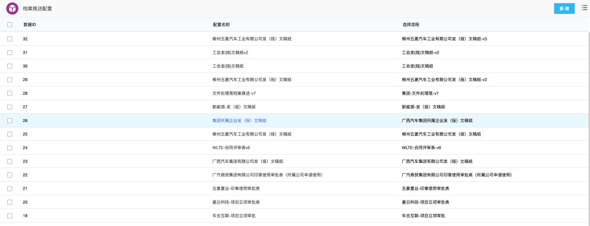  


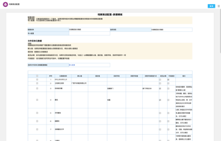

#### 归档元数据配置

支持动态生成元数据，归档元数据会按配置的列表进行生成，配置多少条元数据就生成多少条，可配置元数据的取值方式，可取流程表单字段、流程变量和固定值。
可配置元数据模板，无需每次新建时重新配置元数据，导入元数据模板即可。  
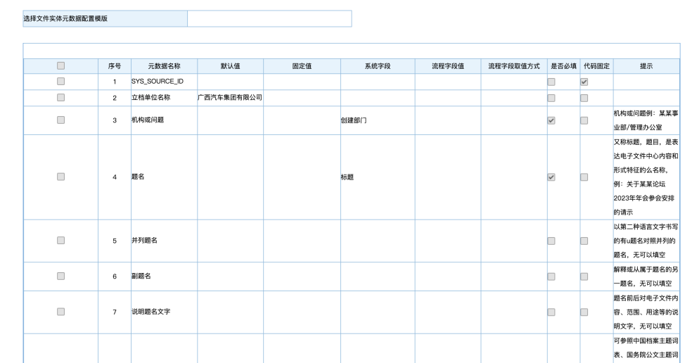

#### 流程文件获取字段

档案推送时需要获取流程文件，可在建模中配置正文和附件对应的流程字段，推送时获取这些字段中的文件。

- 可以做必填校验，如果没有获取到文件则会推送失败
- 支持自动将word文件转换为PDF格式（需要WPS服务），支持使用WPS在线预览和WPS中台进行转换
- 如果附件文件为压缩包，会解压压缩包获取所有文件
- 可生成表单页面PDF文件，并可指定使用哪个节点的页面进行生成页面PDF  
  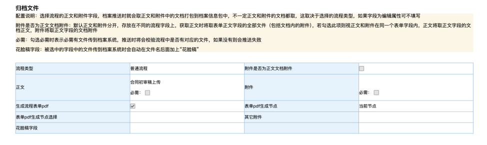

#### 业务实体元数据

可配置每个节点的业务实体元数据生成规则  
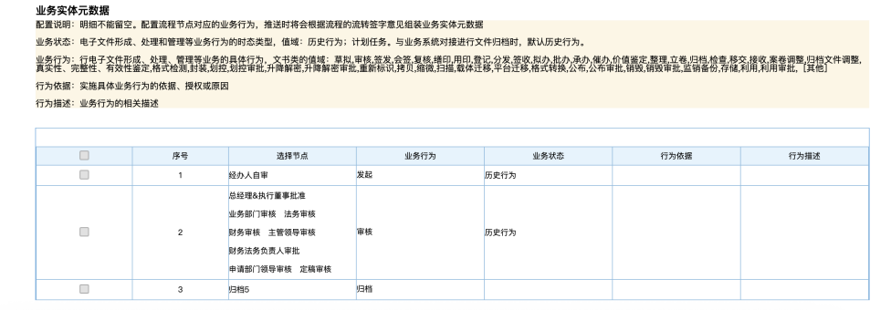

### 流程档案推送执行

#### 流程归档后推送

可配置流程归档时或在指定节点提交后执行档案推送，支持异步执行，需要在节点附加操作添加Action动作。

#### 历史流程批量推送

支持历史流程批量推送，需要在档案推送结果查询中的右上角点击历史流程批量推送按钮（此按钮需要自己配，配置方法详见ecode应用中的readme.md文件），选择要推送历史数据的流程，然后点推送即可。
可随时在页面中查看历史流程推送结果，推送会在后台执行，无需停留在页面，重新打开页面可查看推送进度。  
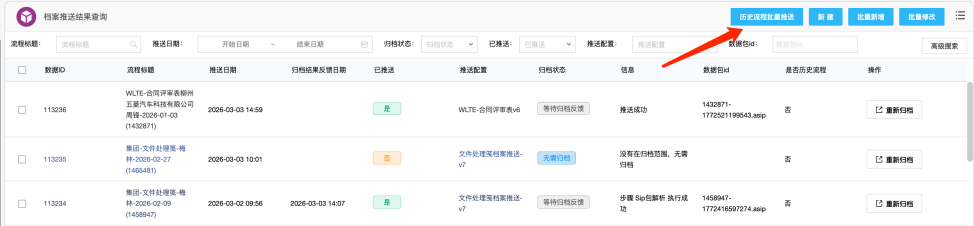


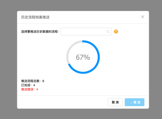

#### 档案打包与上传

使用了量子档案提供的java工具包进行档案包生成，无需关心如何生成xml文件以及档案包结构。
可将档案包通过FTP上传到指定服务器位置。

### 档案推送记录台账

所有流程的档案推送结果都可以在【档案推送结果】建模中查看，支持手动重新推送  
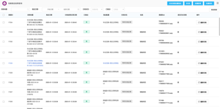  
推送记录中可查看推送发送的报文、返回报文和档案系统归档结果反馈报文，方便排查问题。   
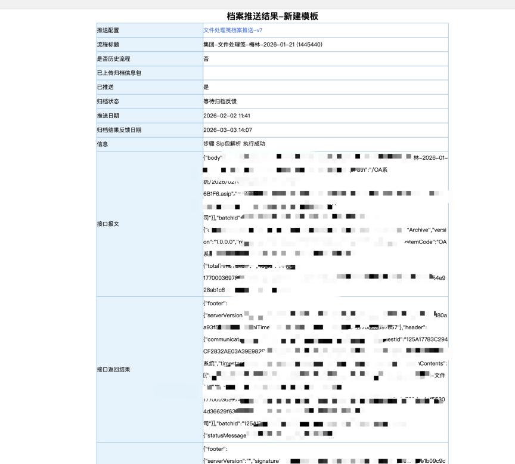

### 档案系统归档结果反馈

归档结果反馈有2个方案，选其中一个方案即可
方案一：
档案系统调用OA归档结果反馈接口，将归档结果反馈至OA，接口地址：`/api/secondev/archive/status`，接口参数格式为档案系统约定，
格式请查看电子文件归档接口设计方案文档中的`通用报文格式定义-》报文结构定义`，该接口需要加入白名单访问。

方案二：
使用计划任务，调用档案系统归档查询接口，定时查询档案归档状态，更新到档案推送结果台账中，
计划任务类：`com.customization.yll.wuling.archive.job.ArchiveStatusCheckJob`。
此方案为OA系统主动查询归档结果。

### 契约锁集成 - 获取盖章文件与签名

支持通过调用契约锁接口，获取表单文件的契约锁盖章文件以及契约锁签名信息，签名信息包括：签名时间、证书颁发机构、证书序列号、
操作人、签名主体、签名原因、签名算法

### 支持查询归档范围验证是否归档

在进行档案推送时，可调用档案系统归档范围查询接口，根据元数据中的“题名”关键字进行查询是否在归档范围内，如果不在归档范围内则不需要推送到档案系统进行归档。

可能归档时会有此需求，有些公文不需要进行归档，需要根据提名判断是否需要归档，比如提名（公文标题）中含有决议、公告、通知这些关键字时，
才需要归档（推送到档案系统）。

## 前置条件

为了能够将doc文档转为PDF，OA需要集成 WPS 在线预览或客户部署有WPS中台

## 开发相关文件

1. 建模应用 zip 包
2. Ecode 应用包
3. 开发 jar文件
4. 第三方jar包
5. 字体包

## 部署说明

### 开发包部署

开发包有两种部署方式：

#### 一、jar包部署

下载本项目中的 weaver-seconddev-pde-archive-1.0.0.jar ，将此 jar 包放入到 `ecology/WEB-INF/lib` 中

#### 二、源码编译

本地需要有泛微开发环境,下载本项目的源码进行编译，然后打成 jar 包放入`ecology/WEB-INF/lib` 中，或将 class 文件放入 `ecology/classbean` 中


### 服务器 jar 包部署

1. 将服务器中 `ecology/WEB-INF/dom4j-1.6.1.jar` 文件删除，开发包里面已经有了比这个更高版本的jar包，此操作是将低版本的jar包移除，
原因是档案系统中提供的依赖中使用的是高版本的jar包，使用服务器中低版本jar包会导致报错
2. 将服务器中的 `ecology/WEB-INF/hutool-all-5.3.0.jar` 删除，原因同上，换成更高版本的
3. 将项目内的 out-dep 目录下的 jar 包放入服务器的 `ecology/WEB-INF/lib` 目录中
4. 部署公共类库：本项目需要依赖公共类库，请前往此页面下载里面的公共类库，将 jar 包让入`ecology/WEB-INF/lib` 目录中，地址：
   https://github.com/YaoLilin/weaver-e9-common

### 添加字体包

将项目里的字体包文件夹内的 ecology 文件夹覆盖到服务器， 此步骤是为了在生成流程表单pdf和doc转pdf时有对应的字体，如果服务器已有字体请忽略

### 添加接口白名单

添加接口白名单，编辑 `ecology/WEB-INF/prop/weaver_session_filter.properties` 配置文件，
将 `/api/secondev/archive/status` 和 `/api/open/second-dev/doc/download` 这两个接口地址加到配置文件内的
`unchecksessionurl` 属性中，注意接口地址之间要用分号隔开

### 修改配置文件并放入服务器

编辑 `src/main/resources/WEB-INF/prop` 中的配置文件 `FW20240726-archiveSystem.properties` ，修改里面的属性为实际的值，
并将配置文件放入服务器 `ecology/WEB-INF/prop` 文件夹中。

### Ecode和建模部署

1. 导入项目内的建模应用
2. 导入项目内的ecode应用，关于ecode的配置请看ecode应用中readme.md文件

### 流程Acton配置

Action 地址为：`com.customization.yll.wuling.archive.action.ArchiveDataPushAction`
在需要推送档案的流程的归档节点的节点前附加操作配置action，action有1个参数：

- async：是否异步推送，异步填1，同步填0，默认异步。如果选择同步推送，将会阻塞流程提交，推送耗时可能会有10秒或更多，
  如果推送失败流程会有提示信息，并阻断提交。

### 配置计划任务（归档结果反馈使用调用档案系统归档查询接口时使用）

如果档案归档结果反馈是档案系统调用OA反馈接口，则不需要配此计划任务。
在集成中心中配置计划任务，该计划任务是定时查询档案归档结果，并将归档结果记录到档案推送结果台账中。
计划任务类：`com.customization.yll.wuling.archive.job.ArchiveStatusCheckJob`
计划任务执行时间可以设为每2小时执行一次，或者自定义。  

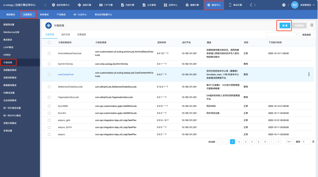


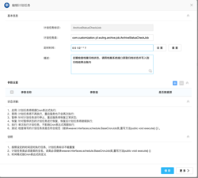

### 确认数据展现集成浏览框

导入建模时会同时导入数据展现集成浏览框，但因数据库不同，浏览框里的SQL可能会不适用，如果发现建模配置或归档结果台账和历史流程推送中选择不到流程的请看，
请检查数据展现集成浏览框的SQL，使用AI提问就能将SQL转为数据库支持的SQL。浏览框包括：

1. 选择流程浏览框，标识：select_workflow
2. 选择请求流程，标识：	selecte_request
3. 选择字段，标识：select_field

### 新增数据展现集成浏览框

有1个浏览框需要自行新增，需要到集成中心的数据展现集成进行添加  
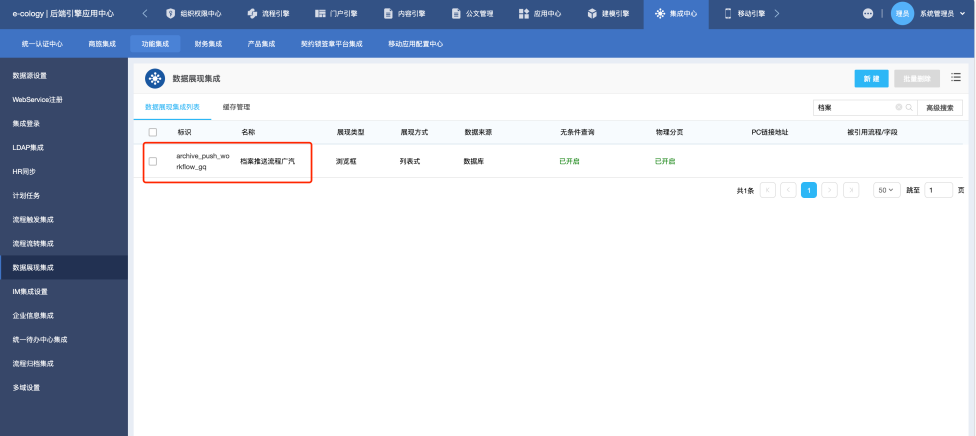


配置如下，标识需要固定为：`archive_push_workflow_gq`
Sql：

```sql
SELECT 
    a.id,
    CONCAT(a.workflowname, COALESCE(CONCAT('-v', a.VERSION), '')) AS workflow_name,
		b.TYPENAME,
		a.version
FROM 
    workflow_base a
left join workflow_type b on a.workflowtype = b.id
where EXISTS (SELECT id from uf_achive_config u where u.workflow = a.id)
```

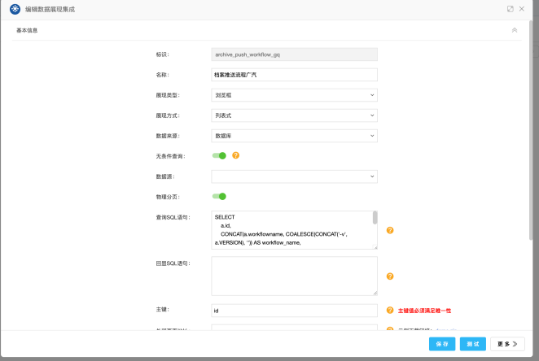


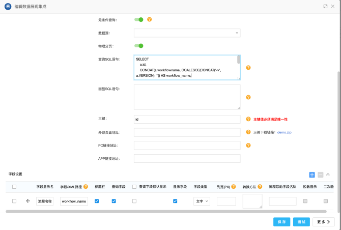

## 档案推送配置

1. 到档案推送配置建模中新建推送配置  
   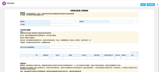
2. 每个档案推送配置只能对应一个流程版本，如果有新的流程版本则需要新建新的推送配置。在配置中选择档案推送流程  
   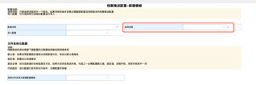
3. 选择文件实体元数据配置模版，选择默认配置，接着会带出元数据明细，明细中的内容将会作为元数据字段传到档案系统，需要你配置每个元数据字段的取值，可以是取流程字段，或固定值等。
   如果默认的元数据模板没有满足推送要求，可以在【推案推送文件实体元数据配置模版】模块中新建一个元数据模板。  
   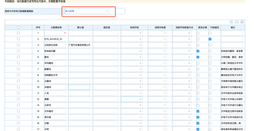
4. 配置需要传到档案系统的文件，传正文或者附件，可以在这里配。如果勾选生成表单PDF，一定要在流程中打开流程存为文档功能，并勾选离线表单PDF。  
   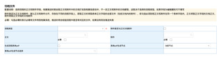
5. 配置业务实体元数据，将会传流程节点的签字意见等信息到档案系统  
   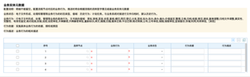

### 导入配置

可以选择从其它以配置好的推送配置进行导入，无需再重新配置，请注意，因为各版本的流程的节点id不同，需要重新配置业务实体元数据中的节点  

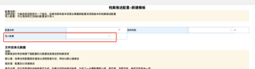

## 相关文档

- 广西汽车集团-电子文件归档接口设计方案-v1.0-20240527 (1).docx
- 中华人民共和国档案行业标准文书类电子文件元数据方案（DA_T 46-2009）.pdf
